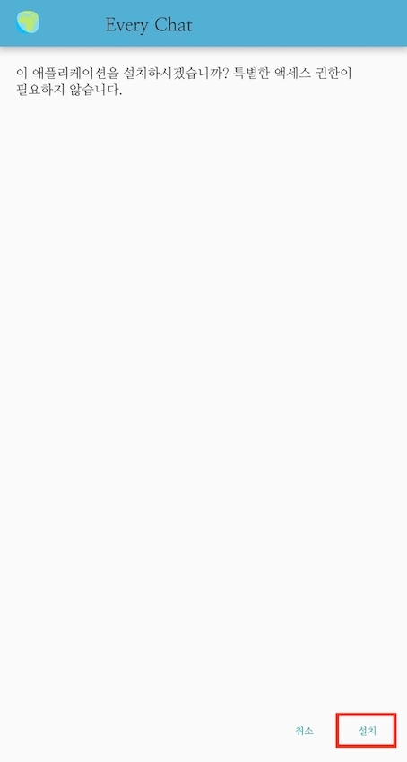

# 모두의 톡 
## 피보호자의 안전 확보를 위한 안드로이드 메신저 어플
> 모두의 톡은 피보호자의 응급 상황에 보호자가 신속하게 대처할 수 있는 안드로이드 메신저 어플입니다.
## 앱 설치 방법 및 사용법
#### 1. 안드로이드 기기에 [APK](https://github.com/HeejoNam/OpenSW/blob/master/app-debug.apk)다운로드

#### 2. 기기에 애플리케이션 설치
<div>


</div>

#### 3. 애플리케이션 위치 정보 권한 허용 설정


#### 4. 계정 선택/추가
<div>


</div>

## 주요 기능
### 1. 보호자와 피보호자의 허용 거리 설정 
```c
    @Override
    protected void onCreate(Bundle savedInstanceState) {
        super.onCreate(savedInstanceState);
        setContentView(R.layout.activity_dist);

        Intent intent = getIntent();
        p_latitude = Float.parseFloat(intent.getStringExtra("p_latitude"));
        p_latitude = Float.parseFloat(intent.getStringExtra("p_longitude"));
        name =intent.getStringExtra("name");

        distance_button=(EditText) findViewById(R.id.editText);
        button = (Button) findViewById(R.id.button3);
        button.setOnClickListener(new View.OnClickListener(){
            @Override
            public void onClick(View view) {
                Intent intent = new Intent(DistanceActivity.this, MapsActivity.class);
                dist = distance_button.getText().toString();
                intent.putExtra(DISTANCE, dist);
                intent.putExtra(LAT, Float.toString(p_latitude));
                intent.putExtra(LONG, Float.toString(p_longitude));
                intent.putExtra(NAME, name);

                startActivity(intent);
            }
        });

    }

```
보호자와 피보호자의 허용 범위를 입력한 후, 버튼을 누르면 다음 activity 가 실행될 때 입력값이 함께 추가된다.
  
### 2. 사용자의 실시간 위치 확인
```c
mMap.setMyLocationEnabled(true);
mMap.setOnMyLocationChangeListener(new GoogleMap.OnMyLocationChangeListener() {
    @Override
    public void onMyLocationChange(Location location) {
        LatLng ll = new LatLng(location.getLatitude(), location.getLongitude());
        latitude = location.getLatitude();
        longitude = location.getLongitude();
        locationB.setLatitude(latitude);
        locationB.setLongitude(longitude);
        addPointToViewPort(ll);
        // we only want to grab the location once, to allow the user to pan and zoom freely.
        mMap.setOnMyLocationChangeListener(null);

    }
});
```
Google Place API 와 Firebase 를 연동하여 사용자의 실시간 위치를 확인할 수 있는 기능을 구현한다.

### 3. 보호자와 피보호자 간에 허용 거리 이상으로 멀어졌는지 확인
```c
        Intent intent = getIntent();
        String message = intent.getStringExtra(DistanceActivity.DISTANCE);
        String message2 = intent.getStringExtra(DistanceActivity.LAT);
        String message3 = intent.getStringExtra(DistanceActivity.LONG);
        String message4 = intent.getStringExtra(DistanceActivity.NAME);

        final int distance = Integer.parseInt(message);
        final String name = message4;
        float p_latitude = Float.parseFloat(message2);
        float p_longitude = Float.parseFloat(message3);

        ward = new Location("point W");
        ward.setLatitude(p_latitude);
        ward.setLongitude(p_longitude);
        between_distance = ward.distanceTo(locationB);

        final Button button = (Button) findViewById(R.id.checkout_button);
        button.setOnClickListener(new View.OnClickListener() {
            @Override
            public void onClick(View view) {
                if (between_distance/1000 > distance) {
                    Toast.makeText(getApplicationContext(), name+" 님과 허용 거리 이상으로 멀어졌습니다.",Toast.LENGTH_LONG).show();
                    //Toast.makeText(getApplicationContext(), String.valueOf(latitude) + "\t" + String.valueOf(longitude), Toast.LENGTH_LONG).show();
                }
            }
        });
    }
```
보호자와 피보호자의 위도,경도를 이용하여 두 사용자간의 거리를 측정하고, 허용 거리를 넘으면 "상대방과 허용 거리 이상으로 멀어졌습니다." 라는 토스트가 뜬다.


### 4. 피보호자의 정보 입력받기
```c
@Override
    protected void onCreate(Bundle savedInstanceState) {
        super.onCreate(savedInstanceState);
        setContentView(R.layout.activity_info);
        name=(EditText) findViewById(R.id.name);
        p_latitude  =(EditText) findViewById(R.id.latitude);
        p_longitude  =(EditText) findViewById(R.id.longitude);
        info_button = (Button) findViewById(R.id.info_button);

        info_button.setOnClickListener(new View.OnClickListener(){
            @Override
            public void onClick(View view) {
                Intent intent = new Intent(InfoActivity.this, DistanceActivity.class);
                pname = name.getText().toString();
                platitude = Float.parseFloat(p_latitude.getText().toString());
                plongitude = Float.parseFloat(p_longitude.getText().toString());

                intent.putExtra("p_longitude", Float.toString(plongitude));
                intent.putExtra("p_latitude", Float.toString(platitude));
                intent.putExtra("name",pname);
                startActivity(intent);
            }
        });

    }
```
피보호자의 실시간 위치 정보를 받아온다. 

## 개발자 정보
- 남희조 (HeejoNam): 지도 api 연동, 거리 측정 알고리즘 등의 계획한 기능 구현 및 어플 제작
- 윤혜정 (Hy3Jung): 지도 api 연동, 거리 측정 알고리즘 등의 계획한 기능 구현 및 어플 제작
- 정부용 (enormdragon): 사용자 인터페이스 수정
- 박지연 (bgy1060): 사용자 인터페이스 수정
- 주수아 (8Orangejuice8): 사용자 인터페이스 수정

## 라이센스
This project is licensed under the terms of the [MIT license](https://github.com/HeejoNam/OpenSW/blob/master/LICENSE).
